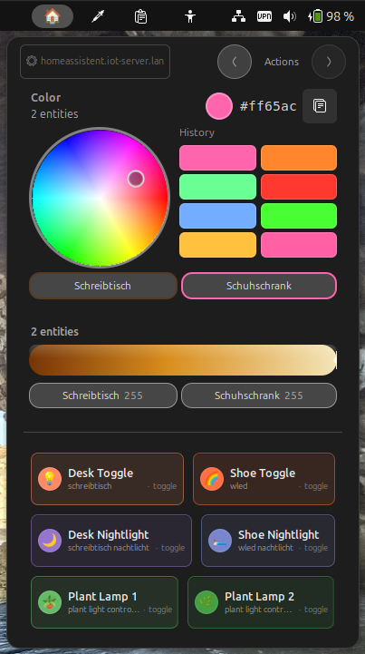
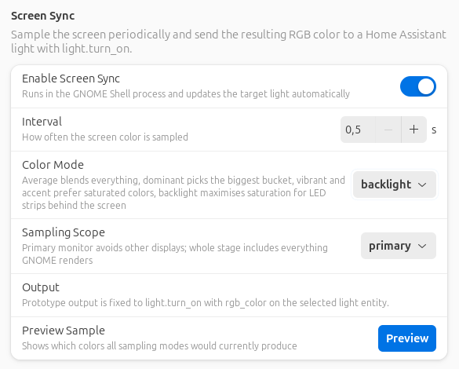
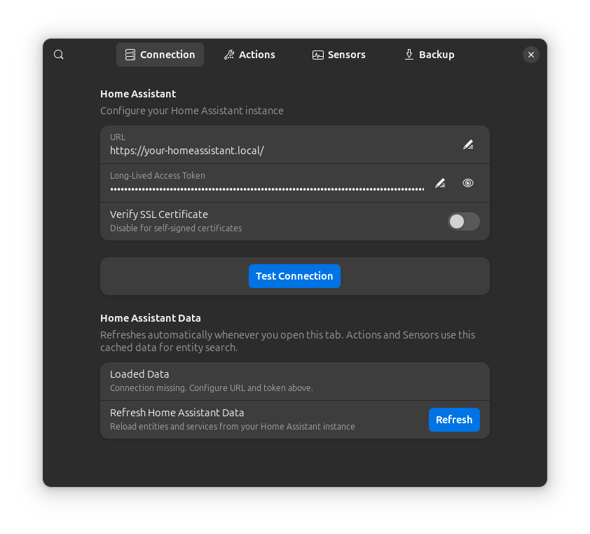

# HAControlPanel

HAControlPanel is a GNOME Shell extension that adds a compact Home Assistant control panel to the top bar. It is built for quick everyday actions: lights, sliders, custom service buttons, read-only sensor tiles, and optional screen sync for RGB lights.

> This repository is currently in beta. Significant parts of the project are developed with AI assistance, so behavior, UX, and internal structure may still change quickly.

<table>
  <tr>
    <td align="center" width="34%">
      <br>
      <sub>🎛️ Panel: color picker, sliders, and quick action buttons</sub>
    </td>
    <td align="center" width="33%">
      <br>
      <sub>🖥️ Screen Sync: multi-light sync, preview, and condition gating</sub>
    </td>
    <td align="center" width="33%">
      <br>
      <sub>⚙️ Preferences: connection, actions, sensors, and backup</sub>
    </td>
  </tr>
</table>

## ✨ Highlights

- 🎚️ Top bar popup with separate Actions and Sensors views
- 🎨 Live color picker for up to 4 RGB-capable Home Assistant lights
- 🔆 Slider controls with configurable entity, service, attribute, and range
- 🧩 Custom action buttons with emoji, optional button color, and JSON service data
- 🌡️ Sensor widgets for read-only status tiles in the panel menu
- 🖥️ Screen sync with multiple target lights, selectable sampling mode, scope, interval, and preview
- ✅ Optional screen sync condition based on any Home Assistant entity using "=", "!=", or "regex"
- 🔎 Condition debugging with live status dot, manual check, and last-24-hours state log
- 💾 YAML export, import, validation, auto-backup, and sync from file
- 🔐 Backup files intentionally exclude the Home Assistant access token

## ✅ Requirements

- GNOME Shell 45, 46, or 47
- `gjs`, `glib-compile-schemas`, and standard GNOME extension tooling
- A reachable Home Assistant instance with a long-lived access token

## 📦 Installation

Until the extension is published on extensions.gnome.org, install it from the GitHub Releases page.

1. Download `hacontrolpanel@friedjof.github.io.shell-extension.zip` from the latest release.
2. Install it with `gnome-extensions install --force hacontrolpanel@friedjof.github.io.shell-extension.zip`.
3. Enable it with `gnome-extensions enable hacontrolpanel@friedjof.github.io` or through the Extensions app.

## ⚙️ Configuration

The preferences window is split into focused pages:

- `Connection`: Home Assistant URL, long-lived access token, SSL verification, connection test, and entity/service refresh
- `Actions`: color picker entities, slider entities, action buttons, and screen sync setup
- `Sensors`: read-only sensor tiles for the panel menu
- `Backup`: YAML export/import, validation, auto-backup, editor integration, and sync from file

The backup validator checks for broken or suspicious values before import or sync, including empty required entity IDs in panel configuration.

## 🛠️ Development

The extension source lives in:

```text
hacontrolpanel@friedjof.github.io/
```

Useful commands:

- `make install` compiles schemas and copies the extension into the local GNOME Shell extensions directory
- `make reinstall` removes and installs again
- `make pack` creates `dist/hacontrolpanel@friedjof.github.io.shell-extension.zip`
- `make run` starts a nested GNOME Shell session and writes logs to `/tmp/roompanel-shell.log`
- `make log` prints the last nested-shell log

## 📝 Notes

- `hacontrolpanel@friedjof.github.io/schemas/gschemas.compiled` is generated and should not be committed
- Local tool configuration in `.claude/` is intentionally ignored
- YAML backups include panel settings, buttons, sensors, and screen sync condition data, but never the Home Assistant token
